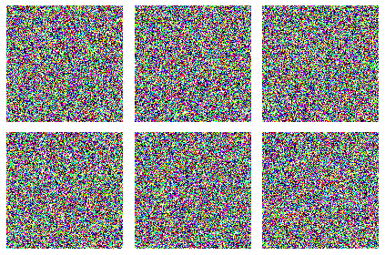

# Conidtional Denoising Diffusion Model for generating Calcified 2D Artery
This Python script uses TensorFlow and Keras to process and train a neural network model on a dataset of images and corresponding stress maps. The script includes functions for image preprocessing and dataset preparation. It then retrieves image files from specified directories, prepares the dataset, and splits it into training and validation sets.
   1. Kindly download the Artery file that includes two folders of images: Input and Stress Map.
   2. Proceed to execute the code in the Jupyter notebook, ensuring that you're using a GPU for computation.
   3. You're welcome to adjust the hyperparameters in the code as per your requirements.
Here is some Python code:




Set up:

```python
import math
import matplotlib.pyplot as plt
import tensorflow as tf
import tensorflow_datasets as tfds

from tensorflow import keras
from keras import layers
import glob

from tensorflow.keras import regularizers


# Hyperparameters
